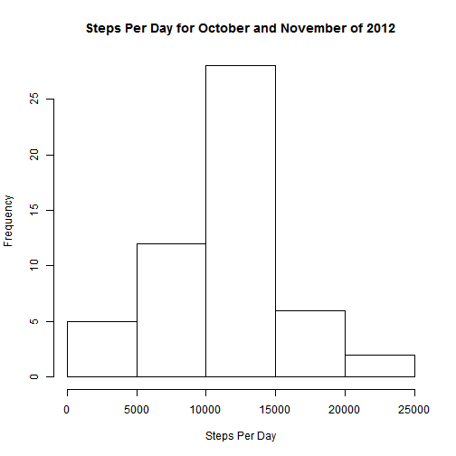
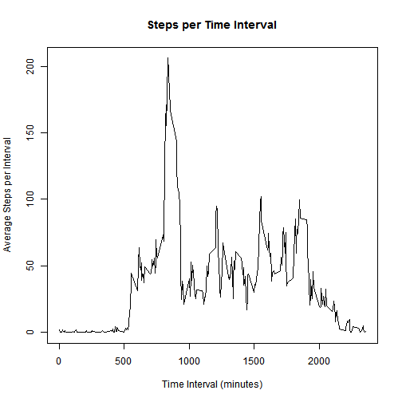
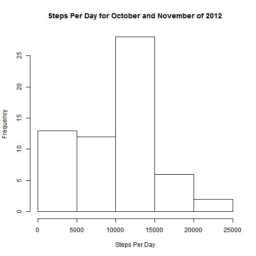
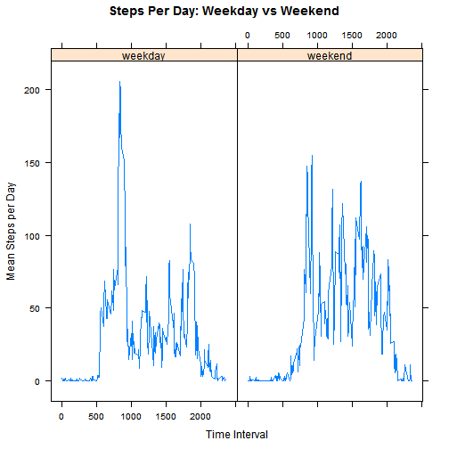

**Loading Necessary Packages**

```r
library(lattice)
```

###1. Loading and preprocessing the data


**Downloading files containing the data**

```r
if (!file.exists("./ReproducibleResearch")){dir.create("./ReproducibleResearch")}
download.file("https://d396qusza40orc.cloudfront.net/repdata%2Fdata%2Factivity.zip", destfile = "temp.zip")
unzip("temp.zip", exdir = "./ReproducibleResearch/Project1")
```

**Reading Dataset into R**

```r
activity <- read.csv("./ReproducibleResearch/project1/activity.csv", stringsAsFactors = FALSE)
activity$date <- as.Date(activity$date)
```

###2. What is mean total number of steps taken per day (ignoring missing values)?

**Make a histogram of the total number of steps taken each day**


```r
stepsperday <- aggregate(activity$steps~activity$date, FUN = sum, na.rm=TRUE)
names(stepsperday) <- c("date", "steps")

hist(stepsperday$steps, xlab = "Steps Per Day", main = "Steps Per Day for October and November of 2012")
```



**Calculate and report the mean and median total number of steps taken per day**

```r
meanstepsperday <- round(mean(stepsperday$steps), digits = 0)
meanstepsperday <-  as.integer(meanstepsperday)
medianstepsperday <- median(stepsperday$steps)
```

- The mean number of steps per day is 10766
- The median number of steps per day is 10765


###3. What is the average daily activity pattern?
**Make a time series plot**

```r
stepsperinterval <- aggregate(activity$steps~activity$interval, FUN=mean, na.rm=TRUE)
names(stepsperinterval) <- c("interval", "steps")


with(stepsperinterval, plot(interval, steps, type = "l", 
    main = "Steps per Time Interval", 
    xlab = "Time Interval (minutes)", 
    ylab= "Average Steps per Interval"))
```



**Which 5-minute interval, on average across all the days in the dataset, contains the maximum number of steps?**


```r
maxsteps <-  which.max(stepsperinterval$steps)
maxstepstimeinterval <- stepsperinterval[maxsteps,1]
```

The Time Interval corresponding to the maximum average steps is 835

###4. Imputing missing values
**Calculate and report the total number of missing values in the dataset.**


```r
numberna <- sum(is.na(activity$steps))
```

The total number of missing values is 2304

**Devise a strategy for filling in all of the missing values in the dataset.**

The method that I chose for imputing missing values was to use the median for the particular 5-minutes time interval for which the 'NA' occurred. I used the median rather than the mean because the median is less sensitive to outliers.

**Create a new dataset that is equal to the original dataset but with the missing data filled in.**


```r
activity1 <- activity
medianstepsperinterval <- aggregate(activity1$steps~activity1$interval, FUN=median, na.rm=TRUE)
names(medianstepsperinterval) <- c("interval", "mediansteps")

for (i in 1:length(activity1$steps)) {
    if (is.na(activity1$steps[i])) {activity1$steps[i] <- 
            medianstepsperinterval[medianstepsperinterval$interval ==                       activity1$interval[i],2]
    }
}  
```
**Make a histogram of the total number of steps taken each day and Calculate and report the mean and median total number of steps taken per day. Do these values differ from the estimates from the first part of the assignment? What is the impact of imputing missing data on the estimates of the total daily number of steps?**

```r
stepsperday <- aggregate(activity1$steps~activity1$date, FUN = sum)
names(stepsperday) <- c("date", "steps")

imputedmean <- round(mean(stepsperday$steps), digits =0)
imputedmedian <- median(stepsperday$steps)


hist(stepsperday$steps, xlab = "Steps Per Day", main = "Steps Per Day for October and November of 2012")
```



- The mean for the dataset with imputed values is 9504
- The median for the dataset with imputed values is 10395
- By imputing the values, the mean decreased by 1262
- By imputing the values, the median decreased by 370
- Therefore, the overall impact of imputing the data on the total number of daily steps is the measures of central tedency decreased.  


###5. Are there differences in activity patterns between weekdays and weekends?

**Create a new factor variable in the dataset with two levels -- "weekday" and "weekend" indicating whether a given date is a weekday or weekend day.**


```r
for (i in 1:length(activity1$date)) {
    activity1$weekday[i] <- weekdays(activity1$date[i])
}

activity1$weekday <- as.factor(activity1$weekday)
levels(activity1$weekday) <- c("weekday", "weekday", "weekend", "weekend", "weekday", "weekday", "weekday")
```

**Make a panel plot containing a time series plot**

```r
weekendactivity  <- subset(activity1, weekday == "weekend")
weekdayactvity  <- subset(activity1, weekday == "weekday")

wdaytimeseries <- aggregate(weekdayactvity$steps~weekdayactvity$interval+weekdayactvity$weekday, FUN=mean)
names(wdaytimeseries) <- c("interval", "weekday", "steps")

wendtimeseries <- aggregate(weekendactivity$steps~weekendactivity$interval+weekendactivity$weekday, FUN=mean)
names(wendtimeseries) <- c("interval", "weekday", "steps")

avgstepsbywday  <- rbind(wdaytimeseries, wendtimeseries)

xyplot(steps~interval|weekday, data = avgstepsbywday, type="l", xlab = "Time Interval", ylab = "Mean Steps per Day", main="Steps Per Day: Weekday vs Weekend")
```


